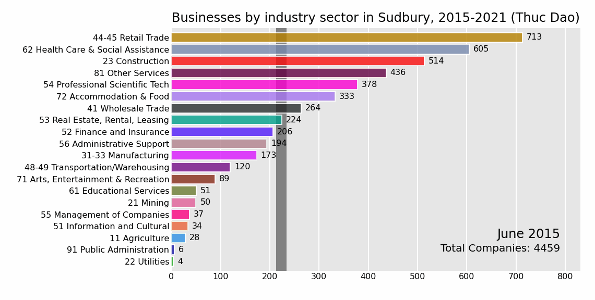

# Visualizing businesses by industry sector in Sudbury, Ontario (2015–2021)

If you are looking for jobs in Sudbury, it is worth knowing not only the number of vacancies but the number of companies also.
Unfortunately, years from 2015 onwards have seen a steady decline in Sudbury's businesses, even before the Covid pandemic, with five exceptions of growth in the mining industry, utilities, information and cultural industry, real estate, and professional scientific technology.

Using the local labour market data from Workforce Planning for Sudbury & Manitoulin and Python programming, I created a running bar chart displaying the shift in the ranking of Sudbury's businesses by industry sector during the period of 2015 - 2021.

This chart shows the active companies = total companies - companies having no employees.

In 2021, among 20 industry sectors, nearly half of them (11) have more than 50% of companies without employees.

The top 3 sectors that have companies without employees are:
1. Real estate (91%)
2. Management of companies (86%)
3. Finance and insurance (79%)

The top 3 sectors of active companies and their percentages of businesses without employees are:
1. Retail trade (34%)
2. Health care (50.5%)
3. Construction (52%)

Note:
- The vertical bar is the mean number of companies per industry sector.
- The two digits before sector names are the first two digits of the NAICS six-digit code.    
  (NAICS: North American Industry Classification System)
- The chart was made in pure Python, and not a product from flourish.studio.

If the chart does not run, please click the ▶ Play button in the top-right corner.

---

**Data source:**    
*Workforce Planning for Sudbury & Manitoulin - Local Labour Market Information*   
https://www.planningourworkforce.ca/labour-market-information/

2015: https://www.planningourworkforce.ca/wp-content/uploads/2016/09/English-Report-2015-LLMP.pdf

2016: https://www.planningourworkforce.ca/wp-content/uploads/2016/09/LLMP-2016-English.pdf

2017: https://www.planningourworkforce.ca/wp-content/uploads/2018/02/LLMP-February-2018-English.pdf

2018: https://www.planningourworkforce.ca/wp-content/uploads/2019/02/ENG-Cover-and-LLMP-2018-2019-1.pdf

2019: https://www.planningourworkforce.ca/wp-content/uploads/2020/02/Local-Labour-Market-Plan-2019-20-English-with-cover.pdf

2020: https://www.planningourworkforce.ca/wp-content/uploads/2021/02/LLMP-2020-21-ENG.pdf

2021: https://www.planningourworkforce.ca/wp-content/uploads/2022/02/LLMP-2021-22-ENG.pdf
